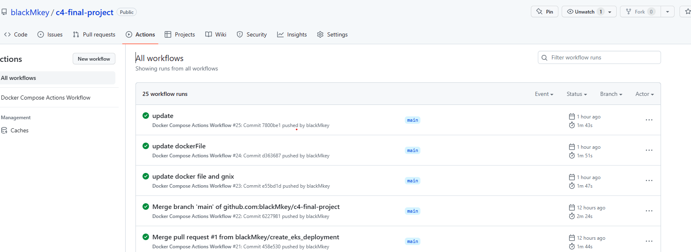

## frontend link 
http://aaeba85624d5946f883819895fde5fd6-150654271.us-east-1.elb.amazonaws.com/

## backend endpoint
7fnf1wopb0.execute-api.us-east-1.amazonaws.com/dev

## Option 1- CICD, Github & Code Quality

evident

## option 1- container

## option 1-  deploy

